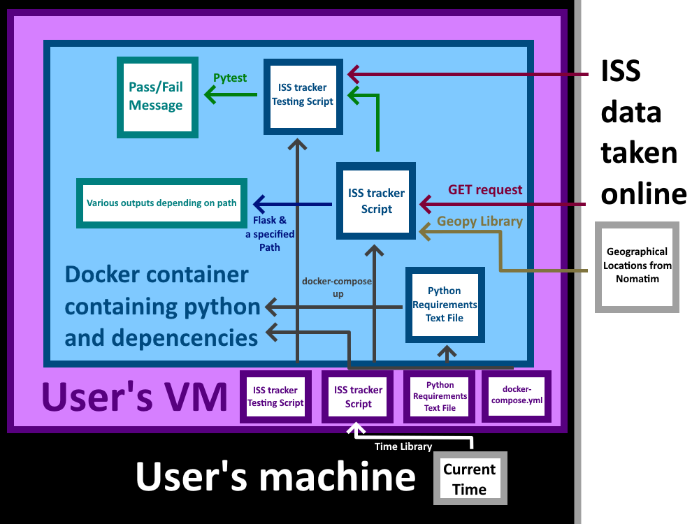

# ISS Data Tracker Application

This project utilizes a container and a script that creates an application which will take time and location data from the ISS and prints out statistics depending on the queries used. This project was created to utilize Flask applications and Docker containers.

### The Data Used

The data used in the script can be obtained through NASA's [ISS Trajectory Data website](https://spotthestation.nasa.gov/trajectory_data.cfm), in xml format. The data file itself contains metadata about the ISS, comments detailing the mass and drag coefficients for the ISS, and the data recorded every ~4 minutes over a 15 day period specifying the time, position, and velocity the ISS has or will be travelling. The data file itself is also updated every few days with new and updated data values.

### Building and Running the Docker Container

This project contains a Dockerfile, a `requirements.txt` file, and a `docker-compose.yml` file which will build the image, install the needed dependencies, and run a container. Using the command:

`docker-compose up -d`

will build the image containing all the neccessary libraries and dependencies to run the flask app, script, and unit tests. The script, unit tests, and the `requirements.txt` file will be located in a directory `/app` in the container. The unit tests will be stored in the directory `/app/test`. ('username' in the `docker-compose.yml` file can be replaced with a username of your choosing.)

Running the command will automatically run the container in the background using the localhost IP and port, `127.0.0.1:5000`, to be utilized with `curl` commands.

The unit tests can be also be run using the command:

`docker exec [container_id] iss_tracker_app.py test/test_iss_tracker.py`

The container and application can be stopped at any time by using the command `docker-compose down`

### Using the Application

The main method of interaction with the application is through `curl` commands. These commands will always be in the format `curl 'localhost:5000/<path>'`. The following paths are available in the application:

- `/comment`

- `/header`

- `/metadata`

- `/epochs?limit=int&offset=int`

- `/epochs/<epoch>`

- `/epochs/<epoch>/speed`

- `/epochs/<epoch>/location`

- `/now`

### Route Descriptions and Output

- `/comment`: This will return the data labelled as 'COMMENT' in the ISS data file

    - Sample Output:

	$ curl 'http://127.0.0.1:5000/comment'
	[
	  "Units are in kg and m^2",
	  "MASS=471702.00",
	  "DRAG_AREA=1487.80",
	  "DRAG_COEFF=2.10",
	  "SOLAR_RAD_AREA=0.00",
	  "SOLAR_RAD_COEFF=0.00",
	  "Orbits start at the ascending node epoch",
	  "ISS first asc. node: EPOCH = 2024-03-06T12:25:13.092 $ ORBIT = 262 $ LAN(DEG) = 113.19491",
	  "ISS last asc. node : EPOCH = 2024-03-21T11:32:04.882 $ ORBIT = 494 $ LAN(DEG) = 37.65767",
	  "Begin sequence of events",
	  "TRAJECTORY EVENT SUMMARY:",
	...

- `/header`: This will return the data labelled as 'header' in the ISS data file

    - Sample Output:

	$ curl 'http://127.0.0.1:5000/header'
	{
	  "CREATION_DATE": "2024-067T16:48:35.714Z",
	  "ORIGINATOR": "JSC"
	}

- `/metadata`: This will return the data labelled as 'metadata' in the ISS data file

    - Sample Output:

	$ curl 'http://127.0.0.1:5000/metadata'
	{
	  "CENTER_NAME": "EARTH",
	  "OBJECT_ID": "1998-067-A",
	  "OBJECT_NAME": "ISS",
	  "REF_FRAME": "EME2000",
	  "START_TIME": "2024-066T12:00:00.000Z",
	  "STOP_TIME": "2024-081T12:00:00.000Z",
	  "TIME_SYSTEM": "UTC"
	}

- `/epochs?limit=int&offset=int`: If an unspecified limit and offset is given, the entire set of data will be returned as a list and outputted onto the screen. A specified limit value replacing 'int' will limit the number of epochs in the list to the specified value. A specified offset value replacing 'int' will begin the list at the specified epoch from the entire list, starting with an index of 0.

    - Sample Output:

	$ curl 'http://127.0.0.1:5000/epochs?limit=1'
	[
	  {
	    "EPOCH": "2024-066T12:00:00.000Z",
	    "X": {
	      "#text": "4268.0238143340603",
	      "@units": "km"
	    },
	    "X_DOT": {
	      "#text": "-1.21858691211102",
	      "@units": "km/s"
	    },
	    "Y": {
	      "#text": "122.835306274768",
	      "@units": "km"
	    },
	    ...

- `/epochs/<epoch>`: This will return and output the specific epoch and data associated with that epoch if a proper epoch is given. Epochs in this data set are typically in the format `yyyy-dddThh:mm:ss.xxxZ`

    - Sample Output:

	$ curl 'http://127.0.0.1:5000/epochs/2024-066T12:00:00.000Z'
	{
	  "EPOCH": "2024-066T12:00:00.000Z",
	  "X": {
	    "#text": "4268.0238143340603",
	    "@units": "km"
	  },
	  "X_DOT": {
	    "#text": "-1.21858691211102",
	    "@units": "km/s"
	  },
	  "Y": {
	    "#text": "122.835306274768",
	    "@units": "km"
	  },
	...

- `/epochs/<epoch>/speed`: This will return and output the speed calculated from the specified epoch if a proper epoch is given.

    - Sample Output:

	$ curl 'http://127.0.0.1:5000/epochs/2024-066T12:00:00.000Z/speed'
	7.651931396786866

- `/epochs/<epoch>/location`: This will return and output the approximate latitude, longitude, altitude in kilometers, and geographical location that the ISS is orbiting over at the given epoch. If there is no geographical location closest to the ISS, 'Over Ocean' will be returned instead.

    - Sample Output:

	$ curl 'http://127.0.0.1:5000/epochs/2024-066T12:00:00.000Z/location'
	[
	  "-51.09781175221881",
	  "20.648538690662157",
	  "421.00853683979494",
	  "Over Ocean"
	]

- `/now`: This will return and output the most recent epoch that has passed, its associated data, speed, coordinates, and approximate current geographical location based on the current time in UTC.

    - Sample Output:

	$ curl 'http://127.0.0.1:5000/now'  # Sample taken at 07:25:44 UTC
	{
	  "ALTITUDE (km)": "418.1268922693207",
	  "COORDINATES": "(-37.92897872690001, 143.11643229427145)",
	  "EPOCH": "2024-068T07:32:00.000Z",
	  "LOCATION": "Chatsworth Road, Derrinallum, Shire of Corangamite, Victoria, 3325, Australia",
	  "SPEED": 7.657511948055634,
	  "X": {
	    "#text": "2910.49466858599",
	    "@units": "km"
	  },
	  "X_DOT": {
	    "#text": "-3.4622535275123698",
	    "@units": "km/s"
	  },
	...

### Software Diagram

This software diagram displays each component of the project, with the files and scripts that are included in each system. The arrows indicate a command or dependency that is associated with each file.

